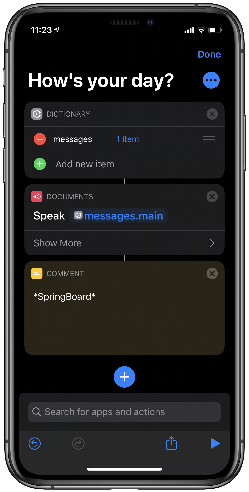
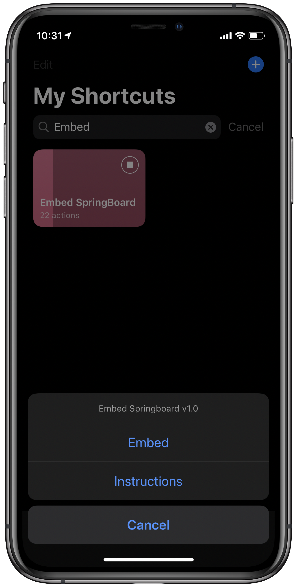
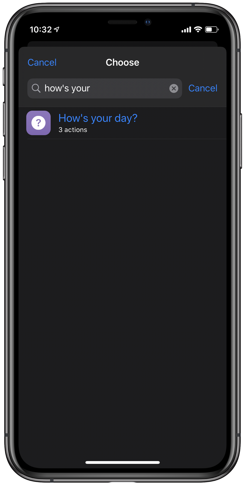
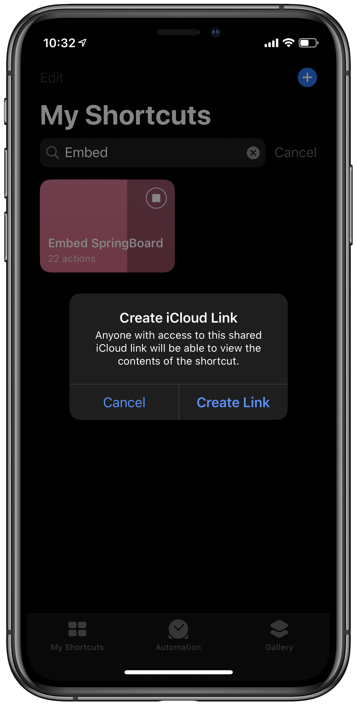
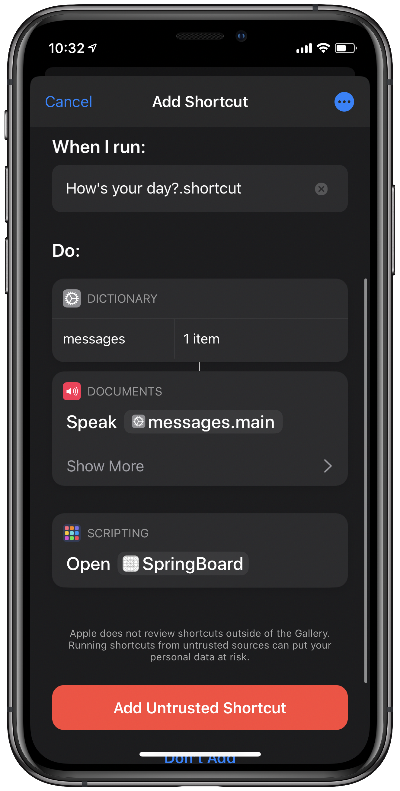

# Embed SpringBoard

  *The simplest way to add the **Open SpringBoard** action to your shortcut.*

This shortcut provides a way to merge the [SpringBoard](https://routinehub.co/shortcut/2900) shortcut into your own shortcut. So, you shouldn't need run the it externally.

### Instructions

1. Add a Comment action to your shortcut where you want the **Open SpringbBoard** to be inserted. Fill it with the text \*SpringBoard\*.
2. Run this shortcut. When presented with the menu, choose `Embed`.
3. Choose your shortcut.
4. When presented with an alert to Create iCloud Link, tap `Create Link`
5. You should be presented with the Add Shortcut screen to import your updated shortcut.

See the screenhots below for the steps above.

