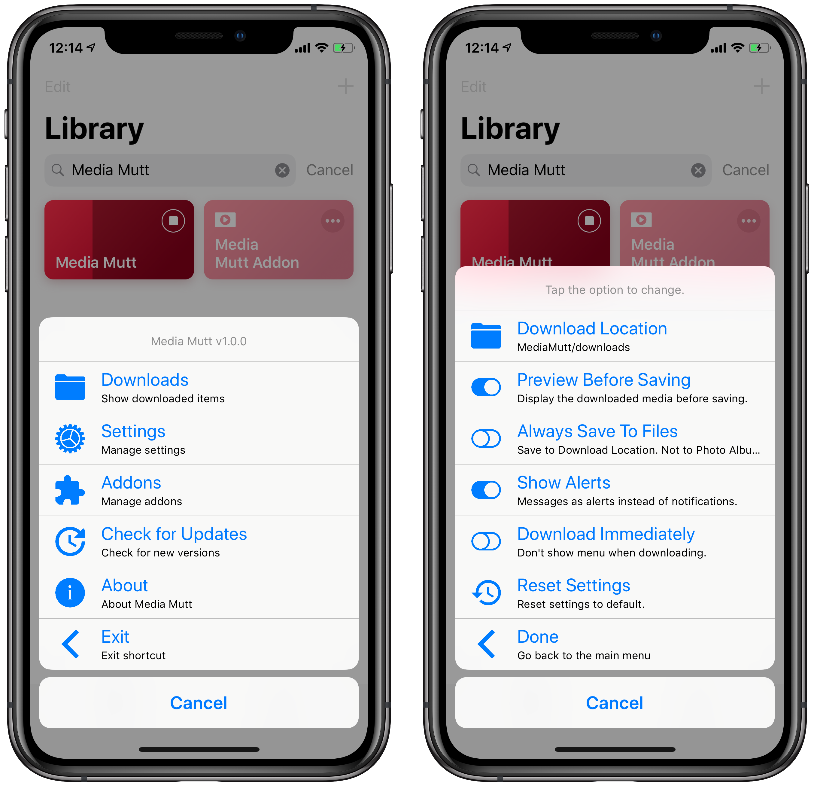
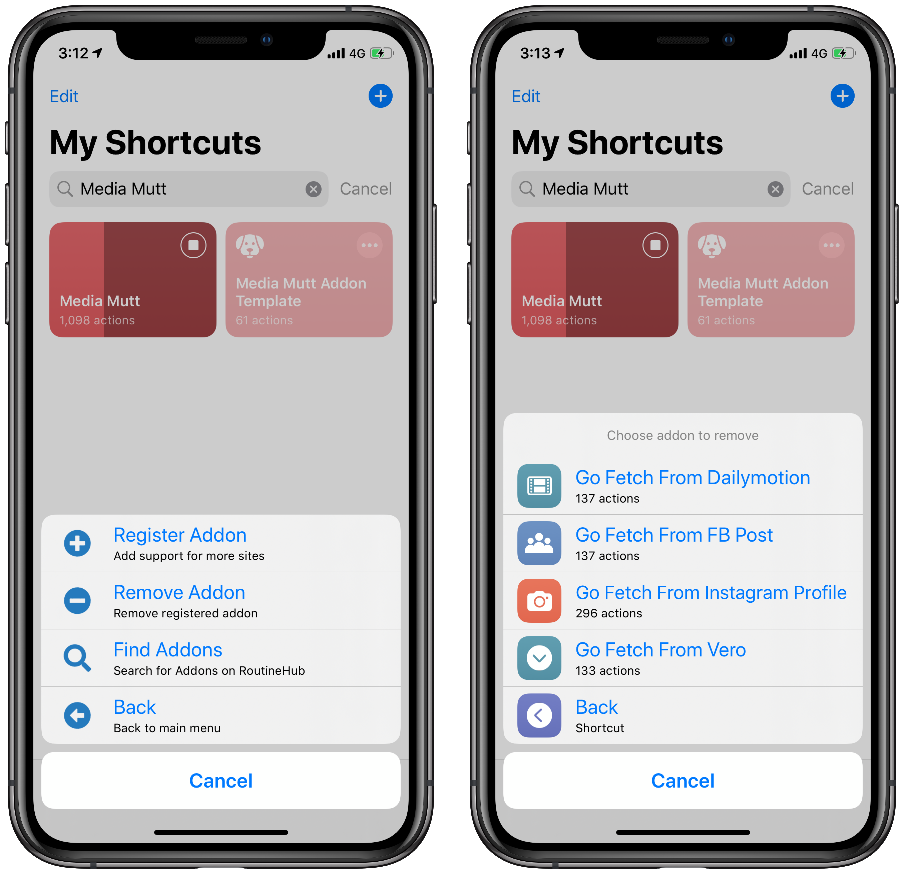
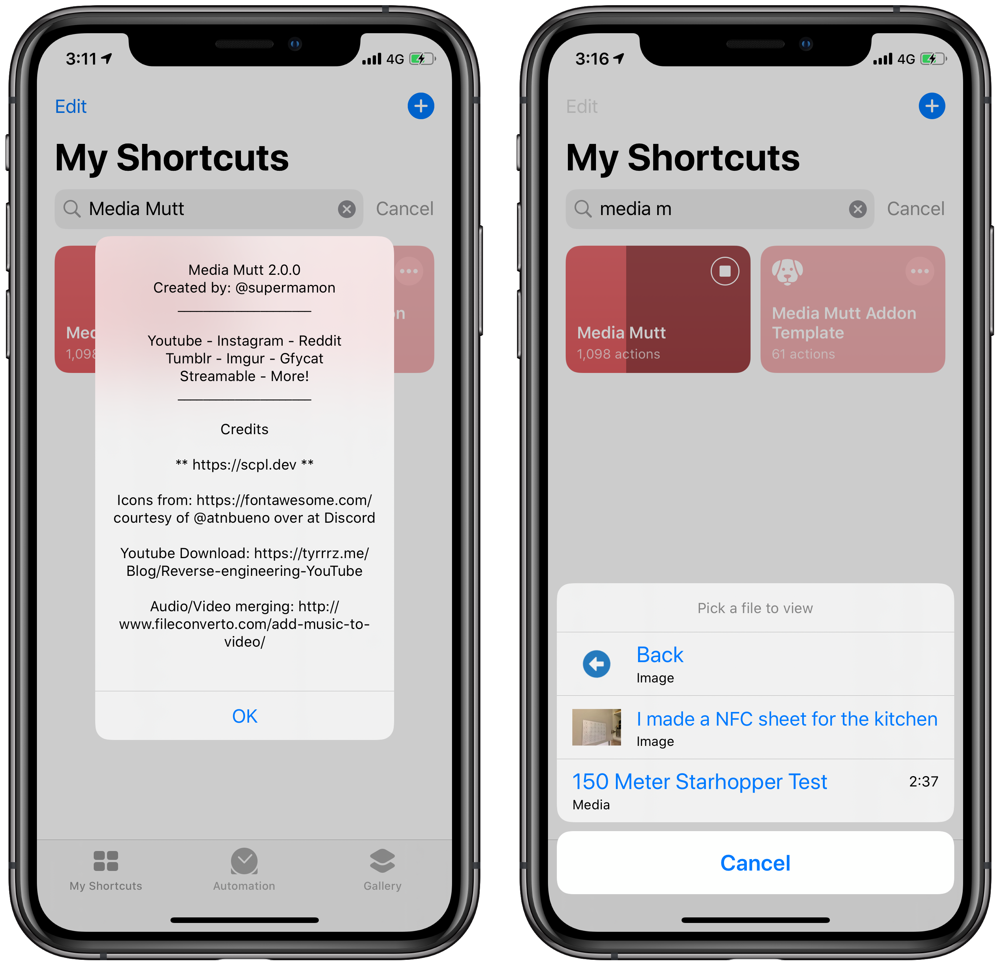

# Media Mutt

*Download Photos and Videos from Anywhere*

Media Mutt is you all-in-one downloader for media pages on the web. It supports the most popular photo and video sharing sites and can support more with the help of addons.

The best feature? It doesn't use third-party websites to download. Everything is done within the shortcut1.

> 1. Fine Print: Techinically, it does use a third-party website to combine audio and video for websites that stream them separately (Reddit, looking at you). Everything else happens within the shortcut.

## Supported Media Pages

Youtube videos • Instagram Posts • Reddit Posts
Tumblr Posts • Imgur • Gfycat
Streamable

## Addons

Dailymotion • Facebook Post (Photo/Video)

## Creating Addons

If you are interested in authoring addons, check out the [authoring guide](making-mediamutt-addons.md).

## Screenshots

## Credits

* I wouldn't have been able to build this complex shortcut without [ScPL](https://scpl.dev). Well I could but it would've taken me months. This took less than 2 werks.
* Icons from [https://fa2png.io]
* YouTube Downloading method - https://tyrrrz.me/Blog/Reverse-engineering-YouTube
* Audio/Video merging: http://www.fileconverto.com/add-music-to-video/
