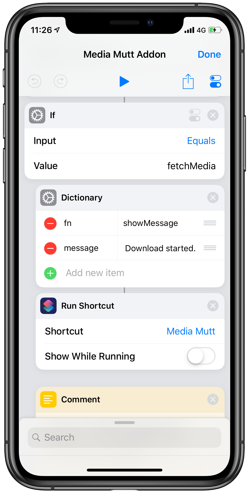

# Making Media Mutt Addons

## Template

Download a copy of the [Media Mutt Addon Template](https://routinehub.co/shortcut/3185).

## Naming

It is recommended to name your addon with the prefix `Go Fetch from` followed by the name of the website. Example: `Go Fetch from Dailymotion` or `Go Fetch from Facebook`.
When registering addons with `Media Mutt` the default shortcut search term is `Fetch`. This will make it easy to find your addon.

## Structure

`Media Mutt` and it's addons are implemented as pseudo-functions. It's a way to mimic subroutines in Shortcuts by using recursion. That's why the *Metadata* update indicated below is important because it relies to it to know the name of the shortcut.

### Metadata

It is required to update the value of the `shortcut` key on the `meta` dictionary to be the same value as the name of your shortcut.

### `main` function

If your addon is run by itself, this is the part where it lands. So of you need to do some onboarding process, you can include them in here.

* Parameters
  * None
* Returns
  * None

### `register` function

This function is called by `Media Mutt` to get information about the addon. Currently, only the name of the addon is required.

* Parameters
  * None
* Returns
  * the name of the addon

### `canProcessURL` function

This function is called by `Media Mutt` to check if the addon is able to download the media for the url being passed. Usually a RegEx match will suffice but you can include further validation if needed.

* Parameters
  * `url` - the url to process
* Output
  * `1` - if the addon can download media from `url`
  * `0` - if the addon is not able to download media from `url`

**`fetchMedia` function**

This is the function that will actually download the media from the passed `url`.

* Parameters
  * `url` - the url to process
* Returns
  * The actual media file

## Utilities

If you need to display any messages, use the method `showMessage` as indicated on the below screenshot. This will follow the user's preference whether they want to show alerts or notifications.

