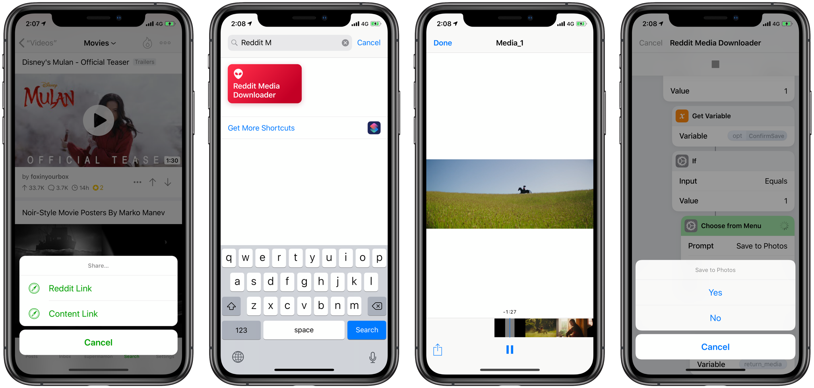

# Reddit Media Downloader

Download media from Reddit Posts

## How to Use

From your Reddit client, tap the share button and send to the shortcut or copy the url into the clipboard and run the shortcut

## Roadmap

* Downloading media linked in comments

## Links

* [My Shortcuts in ScPL](https://github.com/supermamon/shortcuts)
* [ScPL](https://scpl.dev/)
* [Shortcuts Discord](https://discordapp.com/invite/rw8FSaq)
